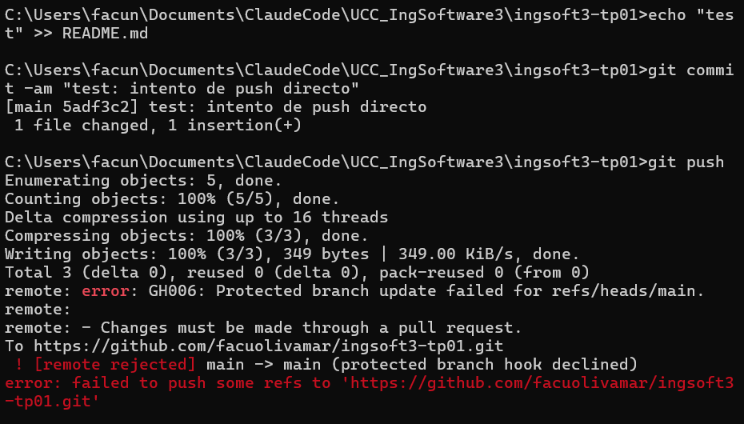
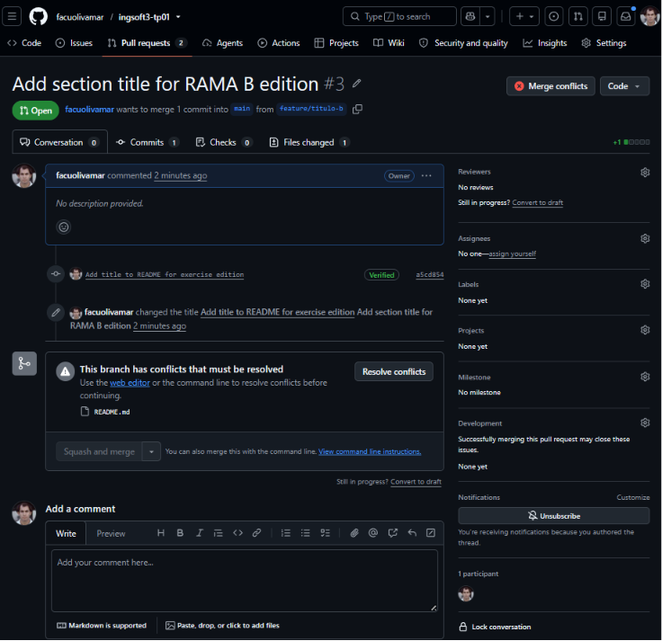
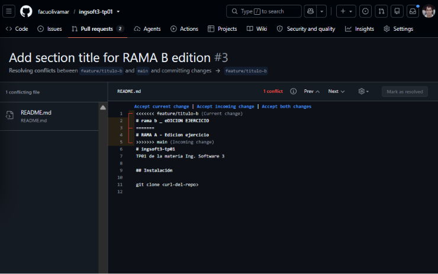
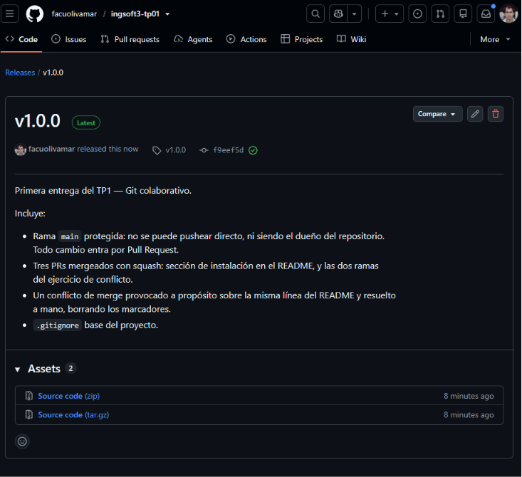
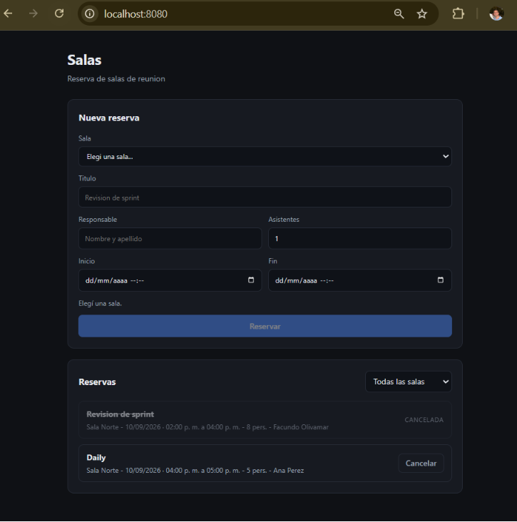
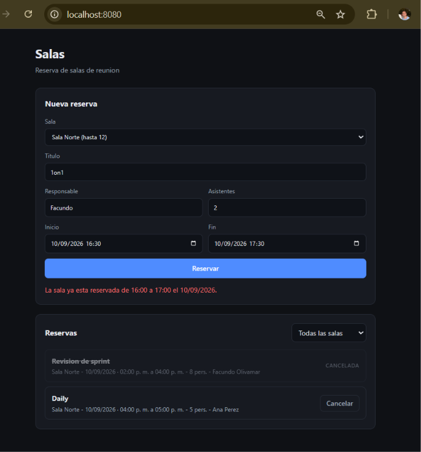
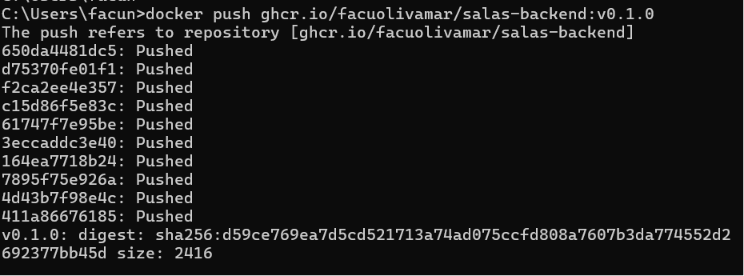
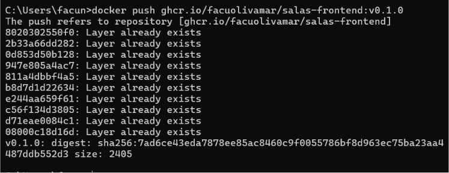
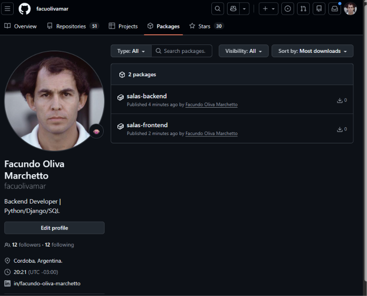

# Evidencias

Capturas y salidas de terminal que prueban que cada cosa funciona. Se acumula por práctico.

---

## TP1 — Git colaborativo

Las cuatro capturas marcadas 📸 en la guía, tomadas en el momento en que ocurrió cada hecho. Tres de
las cuatro son irrepetibles: el aviso de conflicto y los marcadores dejan de existir apenas se
resuelve el conflicto, y la release se publica una sola vez.

Repositorio: https://github.com/facuolivamar/ingsoft3-tp01

---

### 1. Push directo a `main` rechazado



Terminal real, con `main` ya protegida. Se agregó una línea al README, se commiteó localmente
(`5adf3c2`) y se intentó `git push`. Los objetos **viajaron** —se ven `Enumerating objects`,
`Compressing objects` y `Writing objects: 100% (3/3), 349 bytes`— y recién ahí llegó el rechazo,
**del lado del servidor**:

```
remote: error: GH006: Protected branch update failed for refs/heads/main.
remote: - Changes must be made through a pull request.
 ! [remote rejected] main -> main (protected branch hook declined)
error: failed to push some refs to 'https://github.com/facuolivamar/ingsoft3-tp01.git'
```

Ese detalle importa: Git local nunca me frenó. El commit se creó sin problema y los datos se
subieron; quien dijo que no fue GitHub, aplicando la regla. La protección no vive en mi máquina,
vive en el servidor — que es exactamente donde tiene que vivir para que valga para todo el equipo.

Y lo central no es que rechazó, sino **a quién** rechazó: el que empujó es el dueño del repositorio.
La regla se creó con *Do not allow bypassing the above settings*, así que me alcanza igual. Una
protección que el administrador puede saltear no protege: solo protege mientras nadie tenga apuro.

Después de la captura el commit local se descartó con `git reset --hard HEAD~1`. Nunca existió en el
remoto.

---

### 2. El PR de la rama B no se puede mergear: conflicto



Pull Request [#3](https://github.com/facuolivamar/ingsoft3-tp01/pull/3) (`feature/titulo-b` →
`main`), inmediatamente después de mergear el PR
[#2](https://github.com/facuolivamar/ingsoft3-tp01/pull/2) (`feature/titulo-a`). Se ven:

- el badge rojo **Merge conflicts** arriba a la derecha,
- el cartel *This branch has conflicts that must be resolved*, con **`README.md`** como único archivo
  afectado,
- el botón **Squash and merge** **deshabilitado** (gris), y al lado el botón **Resolve conflicts**.

El detalle que vale la pena entender: **este mismo PR figuraba como mergeable un minuto antes.** Las
dos ramas nacieron del mismo commit de `main` y escribieron la misma línea, pero mientras ninguna
estaba integrada no había nada contra qué chocar. El conflicto no nace cuando se escribe el cambio:
nace cuando se lo intenta integrar contra un `main` que ya se movió.

---

### 3. Los marcadores del conflicto



Editor de conflictos de GitHub (`/pull/3/conflicts`), antes de tocar nada. Ahí están las tres
fronteras que deja Git cuando no puede decidir:

```
<<<<<<< feature/titulo-b   (Current change)
# rama b _ eDICION EJERCICIO
=======
# RAMA A - Edicion ejercicio
>>>>>>> main               (Incoming change)
```

Arriba de `=======` está la versión de la rama actual; abajo, la que ya está en `main`. Arriba a la
derecha se lee **1 conflict**, y **Mark as resolved** está deshabilitado: GitHub no deja marcar el
archivo como resuelto mientras quede un solo marcador en el texto.

Lo que **no** está en conflicto es igual de informativo. Las líneas 6 a 12 —`# ingsoft3-tp01`, la
descripción, y la sección `## Instalación` que venía del PR #1— aparecen limpias, sin marcadores.
Ninguna de las dos ramas las tocó, así que Git las fusionó solo, sin preguntar. El conflicto es
quirúrgico: cae sobre la línea disputada, no sobre el archivo entero. Git no razona por archivo,
razona por línea.

Esta captura es la más frágil de las cuatro, porque el paso inmediatamente siguiente es borrar esos
marcadores.

---

### 4. La release `v1.0.0` publicada



Release `v1.0.0` con el badge **Latest**, apuntando al tag `v1.0.0` sobre el commit `f9eef5d` — la
punta de `main` después de mergear los tres PRs, es decir el estado exacto en el que quedó cerrado
el TP1.

El tag se creó **anotado** desde la máquina y después se subió:

```bash
git tag -a v1.0.0 -m "TP1 cerrado: flujo de Pull Requests con main protegida y conflicto resuelto"
git push origin v1.0.0
```

Un tag anotado es un objeto de Git con autor, fecha y mensaje propios; un tag liviano sería apenas un
puntero sin metadatos. Para marcar una entrega corresponde el anotado. La release se publicó desde la
web **sobre ese tag ya existente**: el tag congela el commit, la release le agrega la comunicación
para una persona.

---

## TP2 — Contenedores

Las cuatro cosas que pide el enunciado: el arranque desde cero funcionando end-to-end, la prueba
de persistencia, la comparación de tamaños entre la imagen que compila y la que ejecuta, y las
imágenes publicadas en el registry.

A diferencia del TP1, acá casi toda la evidencia son **salidas de terminal** y no capturas: son
reproducibles, se pueden copiar y pegar, y quien corrige puede correr los mismos comandos.

---

### 1. `docker compose up -d` desde cero

Arranque completo con el volumen recién borrado, o sea sin ningún estado previo:

```
$ docker compose up -d
 Container ingsoft3-tp01-db-1  Creating
 Container ingsoft3-tp01-db-1  Created
 Container ingsoft3-tp01-backend-1  Creating
 Container ingsoft3-tp01-backend-1  Created
 Container ingsoft3-tp01-frontend-1  Creating
 Container ingsoft3-tp01-frontend-1  Created
 Container ingsoft3-tp01-db-1  Starting
 Container ingsoft3-tp01-db-1  Started
 Container ingsoft3-tp01-db-1  Waiting
 Container ingsoft3-tp01-db-1  Healthy
 Container ingsoft3-tp01-backend-1  Starting
 Container ingsoft3-tp01-backend-1  Started
 Container ingsoft3-tp01-frontend-1  Starting
 Container ingsoft3-tp01-frontend-1  Started
```

Las tres líneas del medio son el healthcheck haciendo su trabajo, y son la respuesta a "¿por qué
`depends_on` solo no alcanza?":

```
 Container ingsoft3-tp01-db-1  Waiting     ← compose espera
 Container ingsoft3-tp01-db-1  Healthy     ← pg_isready contestó que sí
 Container ingsoft3-tp01-backend-1  Starting ← recién ahora arranca el backend
```

Sin `condition: service_healthy`, el backend arrancaría en el paso anterior —cuando el contenedor
de Postgres ya existe pero todavía no acepta conexiones— y se caería al intentar conectarse.

Estado de los tres servicios:

```
$ docker compose ps
NAME                       SERVICE    STATUS
ingsoft3-tp01-backend-1    backend    Up (healthy)
ingsoft3-tp01-db-1         db         Up (healthy)
ingsoft3-tp01-frontend-1   frontend   Up
```

### 2. El sistema funcionando end-to-end

La API responde directo, y también a través de nginx, que es el camino que usa el navegador:

```
$ curl -s http://localhost:8000/api/health
{"status":"ok"}

$ curl -s http://localhost:8080/api/salas
[{"id":1,"nombre":"Auditorio","capacidad":40},
 {"id":4,"nombre":"Box de reuniones","capacidad":4},
 {"id":2,"nombre":"Sala Norte","capacidad":12},
 {"id":3,"nombre":"Sala Sur","capacidad":6}]

$ curl -s -o /dev/null -w "HTTP %{http_code}  %{size_download} bytes\n" http://localhost:8080/
HTTP 200  423 bytes
```

El segundo comando es el que importa: el puerto **8080 es nginx**, no el backend. Que devuelva las
salas significa que el proxy `/api/` → `http://backend:8000/api/` está funcionando, y que nginx
resolvió el nombre `backend` por el DNS de la red de Compose. En ningún lado hay una dirección IP.



La app en `localhost:8080`. Se ven las dos piezas del sistema: el formulario de alta y la lista de
reservas, con "Revision de sprint" **cancelada** (tachada y sin botón) y "Daily" confirmada. Abajo
del formulario, el aviso *"Elegí una sala."* y el botón **Reservar deshabilitado**: es la
validación del cliente (`src/format.js`) impidiendo un envío que el backend rechazaría igual.



El mismo formulario, ahora completo y válido *para el cliente*: Sala Norte, 10/09/2026 de 16:30 a
17:30, dos asistentes. El botón **Reservar está habilitado** —la validación de `format.js` no tiene
nada que objetar: la duración es de una hora, hay asistentes, los campos están llenos— y sin embargo
la reserva no entró:

> La sala ya esta reservada de 16:00 a 17:00 el 10/09/2026.

Ese mensaje viene del servidor, con HTTP 409, y lo escribió `validar_sin_solapamiento` en
`rules.py`. El cliente no podía saberlo: para detectar el choque hay que conocer **todas** las
reservas confirmadas de esa sala, y esa información vive en la base.

Las dos capturas juntas muestran la división de responsabilidades. La validación del navegador es
una comodidad: evita un viaje al servidor cuando el error es obvio. La del backend es la que manda,
porque es la única que ve el estado completo del sistema y la única que no se puede saltear
—cualquiera puede mandar un POST con `curl` y esquivar el formulario entero, como se hizo en las
ocho pruebas de acá abajo.

#### Las cinco reglas de negocio, probadas contra la API levantada

Ocho llamadas HTTP. Lo que se verifica no es que la app guarde datos, sino que **se niegue** a
guardar los que violan una regla:

```
--- 1) reserva válida (Sala Norte, 10/09 14:00-16:00)
{"id":1,"titulo":"Revision de sprint","estado":"confirmada", ...}          [HTTP 201]

--- 2) solapamiento (misma sala, 15:00-17:00)
{"detail":"La sala ya esta reservada de 14:00 a 16:00 el 10/09/2026."}     [HTTP 409]

--- 3) caso borde: arranca justo cuando termina la otra (16:00-17:00)
{"id":2,"titulo":"Daily","estado":"confirmada", ...}                        [HTTP 201]

--- 4) capacidad excedida (Box de 4 personas, piden 10)
{"detail":"La sala tiene capacidad para 4 personas y pediste 10."}          [HTTP 409]

--- 5) duración de 15 minutos
{"detail":"La reserva tiene que durar al menos 30 minutos."}                [HTTP 409]

--- 6) reserva en el pasado
{"detail":"No se puede reservar en el pasado."}                             [HTTP 409]

--- 7) cancelar la reserva 1
{"id":1,"estado":"cancelada", ...}                                          [HTTP 200]

--- 8) cancelar la misma reserva otra vez
{"detail":"La reserva ya estaba cancelada."}                                [HTTP 409]
```

El caso **3** es el más interesante y el que más fácil se rompe: una reserva de 16:00 a 17:00
pegada a otra que termina a las 16:00 **no** se solapa, y tiene que entrar. Si la comparación de
los extremos fuera `<=` en vez de `<`, este caso devolvería 409 y la sala quedaría inutilizable
entre reunión y reunión. Los otros siete casos seguirían pasando: por eso el borde se testea
aparte.

El código elegido también es una decisión: **409 Conflict**, no 400. El pedido está bien formado
—el 400 sería para un JSON inválido o un campo faltante—; lo que falla es que choca con el estado
actual del sistema. Esa distinción es la que le permite al frontend mostrar el mensaje de la regla
en vez de un error genérico.

### 3. Prueba de persistencia

**`down` conserva los datos.** El volumen tiene un ciclo de vida propio, independiente del
contenedor:

```
$ curl -s localhost:8080/api/reservas | ...
2 reservas: [(1, 'Revision de sprint', 'cancelada'), (2, 'Daily', 'confirmada')]

$ docker compose down
 Container ingsoft3-tp01-db-1  Removing
 Container ingsoft3-tp01-db-1  Removed
 Network ingsoft3-tp01_default  Removed

$ docker volume ls --filter name=ingsoft3-tp01
ingsoft3-tp01_datos_db          ← el volumen sobrevivió al borrado del contenedor

$ docker compose up -d && curl -s localhost:8080/api/reservas | ...
2 reservas: [(1, 'Revision de sprint', 'cancelada'), (2, 'Daily', 'confirmada')]
```

El contenedor de Postgres fue **destruido y recreado** —no reiniciado— y los datos siguen ahí.

**`down -v` los borra.** La `-v` es la que alcanza al volumen:

```
$ curl -s localhost:8080/api/reservas | ...
2 reservas

$ docker compose down -v
 Container ingsoft3-tp01-db-1  Removed
 Volume ingsoft3-tp01_datos_db  Removing
 Volume ingsoft3-tp01_datos_db  Removed      ← acá se van los datos
 Network ingsoft3-tp01_default  Removed

$ docker volume ls --filter name=ingsoft3-tp01
(ninguno: el volumen se borró)

$ docker compose up -d && curl -s localhost:8080/api/reservas
0 reservas -> BASE VACIA

$ curl -s localhost:8080/api/salas
['Auditorio', 'Box de reuniones', 'Sala Norte', 'Sala Sur']
```

El último comando muestra algo que conviene entender: las **salas** volvieron, las **reservas** no.
Las salas no sobrevivieron al borrado — se volvieron a crear desde cero, porque el backend
siembra el catálogo al arrancar si encuentra la tabla vacía. Las reservas, que son datos que
cargó un usuario, se perdieron y no hay quien las regenere. Es exactamente la diferencia entre
datos de arranque y datos reales, y es la razón por la que solo la base se monta en un volumen.

### 4. Tamaño: la imagen que compila vs la que ejecuta

Las etapas intermedias se construyen aparte con `--target build` para poder medirlas:

```
$ docker build --target build -t salas-backend:etapa-build ./backend
$ docker build --target build -t salas-frontend:etapa-build ./frontend
$ docker images

REPOSITORY:TAG                    SIZE
salas-backend:etapa-build         374MB     ← compila: gcc, libc6-dev, libpq-dev, wheels
ingsoft3-tp01-backend:latest      223MB     ← ejecuta: solo libpq5
salas-frontend:etapa-build        218MB     ← compila: Node 22 + 117 dependencias
ingsoft3-tp01-frontend:latest     48.4MB    ← ejecuta: nginx + los estáticos
```

| Imagen | Compila | Ejecuta | Diferencia |
|---|---|---|---|
| backend | 374 MB | 223 MB | −151 MB (−40%) |
| frontend | 218 MB | 48,4 MB | −169,6 MB (−78%) |

El frontend es el caso extremo y el más claro: la imagen final **no tiene Node instalado**. Vite
produjo HTML, CSS y JavaScript estáticos, y lo único que hace falta para servirlos es nginx. Las
117 dependencias de desarrollo existieron durante el build y se quedaron en la etapa que se
descarta.

En el backend la diferencia es menor en proporción porque el intérprete de Python sí tiene que
estar en la imagen final. Lo que no está es el **compilador**: `gcc`, `libc6-dev` y `libpq-dev`
hicieron falta para construir psycopg2 desde fuente y se quedaron en la etapa 1. La final solo
lleva `libpq5`, la biblioteca cliente que psycopg2 necesita en tiempo de ejecución.

Sin multi-stage, esos 151 MB y 170 MB viajarían a cada entorno en cada despliegue — y, peor que el
peso, cada contenedor en producción tendría un compilador adentro.

### 5. Imágenes publicadas en el registry

Las dos imágenes están en **ghcr.io**, el registry de GitHub, bajo el namespace de la cuenta.



```
$ docker push ghcr.io/facuolivamar/salas-backend:v0.1.0
The push refers to repository [ghcr.io/facuolivamar/salas-backend]
650da4481dc5: Pushed
d75370fe01f1: Pushed
f2ca2ee4e357: Pushed
c15d86f5e83c: Pushed
61747f7e95be: Pushed
3eccaddc3e40: Pushed
164ea7718b24: Pushed
7895f75e926a: Pushed
4d43b7f98e4c: Pushed
411a86676185: Pushed
v0.1.0: digest: sha256:d59ce769ea7d5cd521713a74ad075ccfd808a7607b3da774552d2692377bb45d size: 2416
```

Cada línea es **una capa** de la imagen viajando por separado. Eso no es un detalle cosmético: el
registry almacena capas, no imágenes monolíticas, y por eso una imagen que comparte base con otra
solo sube lo que la diferencia.



```
$ docker push ghcr.io/facuolivamar/salas-frontend:v0.1.0
The push refers to repository [ghcr.io/facuolivamar/salas-frontend]
8020302550f0: Layer already exists
2b33a66dd282: Layer already exists
...
v0.1.0: digest: sha256:7ad6ce43eda7878ee85ac8460c9f0055786bf8d963ec75ba23aa4487ddb552d3 size: 2405
```

Acá todas las capas dicen **`Layer already exists`**: el registry ya tenía esos blobs, así que no
volvió a viajar un solo byte y el push terminó al instante. Es lo que pasa cuando se repite un push
sobre contenido idéntico — las capas se identifican por el hash de su contenido, no por su nombre,
y subir algo que ya está no tiene sentido. Es el mismo mecanismo que hace barato el caché de capas
del TP4.

Las dos líneas `digest: sha256:...` son la identidad real de cada imagen. El tag `v0.1.0` es una
etiqueta que se puede mover; el digest no: identifica exactamente ese contenido y ningún otro.

#### Visibilidad pública



Los dos packages aparecen en `github.com/facuolivamar?tab=packages`, y se les cambió la visibilidad
a **Public** desde *Package settings*, que el enunciado exige para las dos.

Que la interfaz diga "público" es una cosa; que lo sea, otra. La verificación real es pedirle el
manifest al registry **sin ninguna credencial**:

```
$ TOKEN=$(curl -s "https://ghcr.io/token?scope=repository:facuolivamar/salas-backend:pull&service=ghcr.io" | jq -r .token)
$ curl -s -o /dev/null -w "%{http_code}\n" -H "Authorization: Bearer $TOKEN" \
    https://ghcr.io/v2/facuolivamar/salas-backend/manifests/v0.1.0
200

$ # lo mismo para salas-frontend
200
```

El token que devuelve ese endpoint para un repositorio público es anónimo: no lleva usuario ni
contraseña. Los dos `200` son la prueba de que cualquiera, sin cuenta de GitHub, puede bajar estas
imágenes.

### 6. Levantar el sistema sin el código fuente

Ésta es la razón de ser del registry, y `docker-compose.registry.yml` es la variante que lo
demuestra: no tiene ninguna clave `build`, así que no puede compilar aunque quisiera.

Primero se borran las etiquetas locales, para que Docker no tenga las imágenes a mano y esté
obligado a ir a buscarlas:

```
$ docker rmi ghcr.io/facuolivamar/salas-backend:v0.1.0 ghcr.io/facuolivamar/salas-frontend:v0.1.0
Untagged: ghcr.io/facuolivamar/salas-backend:v0.1.0
Untagged: ghcr.io/facuolivamar/salas-backend@sha256:d59ce769ea7d5cd521713a74ad075ccfd808a7607b3da774552d2692377bb45d
Untagged: ghcr.io/facuolivamar/salas-frontend:v0.1.0
Untagged: ghcr.io/facuolivamar/salas-frontend@sha256:7ad6ce43eda7878ee85ac8460c9f0055786bf8d963ec75ba23aa4487ddb552d3

$ docker compose -f docker-compose.registry.yml up -d
 backend Pulling
 frontend Pulling
 frontend Pulled
 backend Pulled
 Container ingsoft3-tp01-db-1  Waiting
 Container ingsoft3-tp01-db-1  Healthy
 Container ingsoft3-tp01-backend-1  Started
 Container ingsoft3-tp01-frontend-1  Started
```

`Pulling` / `Pulled` en vez de `Building`: las imágenes vinieron del registry. Y el healthcheck
sigue funcionando igual, porque es parte de la orquestación y no de la imagen.

Los contenedores corren ahora sobre las imágenes remotas:

```
$ docker compose -f docker-compose.registry.yml ps
SERVICE    IMAGE                                        STATUS
backend    ghcr.io/facuolivamar/salas-backend:v0.1.0    Up
db         postgres:16-alpine                           Up (healthy)
frontend   ghcr.io/facuolivamar/salas-frontend:v0.1.0   Up
```

Y la aplicación responde, con los datos que ya estaban:

```
$ curl -s localhost:8080/api/reservas
3 reservas:
   Revision de sprint | Sala Norte | cancelada
   Daily | Sala Norte | confirmada
   Demo para la catedra | Auditorio | confirmada
```

Dos cosas para notar. La primera: **las tres reservas siguen ahí** aunque los contenedores de
backend y frontend son otros, construidos en otro momento y bajados de internet. El estado no vive
en los contenedores, vive en el volumen.

La segunda es la que importa para lo que viene: este arranque no necesitó el repositorio. Con el
`docker-compose.registry.yml` y un `.env` alcanza. Eso es lo que va a hacer un entorno de QA o de
producción en los TPs siguientes — consumir imágenes ya construidas, no compilar.
